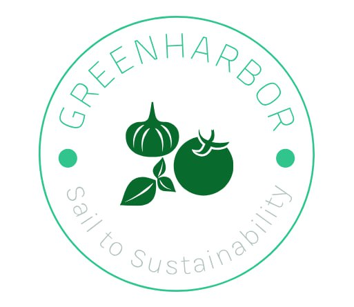
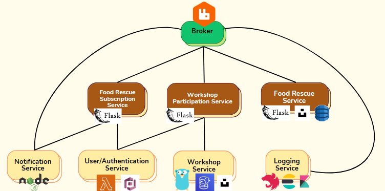
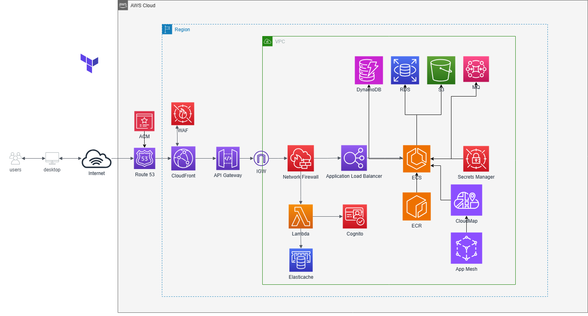

# GreenHarbor

GreenHarbor is a cutting-edge mobile application, crafted with React Native specifically for the freegan community. Our platform is dedicated to those who are passionate about sustainable living and reducing waste, providing a space where like-minded individuals can connect, share, and learn.

## Problem Statement

Freegans face the challenge of staying informed about the latest opportunities to rescue unwanted food and finding communities where they can learn and share skills for sustainable living. They seek to:
- Discover new opportunities for food rescue.
- Join or initiate workshops to learn and teach skills such as repairing items, growing food sustainably, and other eco-friendly practices.

## Our Solution

GreenHarbor addresses these needs with a dual-purpose approach:
- **Food Rescue Feature**: Users can post and receive alerts about food items available for rescue, reducing waste and feeding more.
- **Workshop Platform**: Users can both advertise and sign up for workshops that are designed to enhance the skills of a freegan, from repairing to sustainable growing.

## Microservice Architecture

To support our solution, GreenHarbor is built on a microservice architecture that includes:
- **Notification Service** (Node.js): Manages and sends out notifications for new listings and workshops. [View Repository](https://github.com/GreenHarbor/notification)
- **Authentication Service** (AWS Lambda): Provides secure signup and login functionalities. [View Repository](https://github.com/GreenHarbor/authentication)
- **Workshop Service** (Gorilla Mux): Handles the creation and management of workshop listings. [View Repository](https://github.com/GreenHarbor/workshop)
- **Logging Service** (NestJS): Logs user activities and system events for analytics and monitoring. [View Repository](https://github.com/GreenHarbor/logging)
- **Food Rescue Subscription** (Flask): Manages user subscriptions to food rescue notifications. [View Repository](https://github.com/GreenHarbor/foodrescuesubscription)
- **Workshop Participation** (Flask): Manages user registrations for workshops. [View Repository](https://github.com/GreenHarbor/workshopparticipation)
- **Workshop** (Flask): Oversees the workshop content and schedules. [View Repository](https://github.com/GreenHarbor/workshop)

All services are interconnected through RabbitMQ, ensuring efficient message queuing and service communication.

## AWS Deployment

Our application leverages the power and flexibility of AWS services, including:
- **CloudFront**: Ensures fast content delivery globally.
- **Elastic Container Registry (ECR)**: Stores our Docker container images.
- **Elastic Container Service (ECS)**: Orchestrates the containers of our microservices.
- **Application Load Balancer (ALB)**: Distributes incoming traffic for high availability.
- **Route 53**: Manages DNS for reliable domain name resolution.
- **CloudWatch**: Provides monitoring for our resources and applications.
- **IAM Roles**: Controls access securely to AWS services.
- **MQ**: Hosts our managed RabbitMQ message broker.
- **Web Application Firewall (WAF)**: Offers protection against web exploits.
- **Lambda**: Runs our serverless compute functions.
- **API Gateway**: Manages our APIs lifecycle.
- **S3**: Stores and protects any files and service backups.
- **DynamoDB**: Hosts our NoSQL database for high-performance data retrieval.
- **RDS**: Manages relational database services for structured data.
- **SNS & SQS**: Handles message publishing and queuing.
- **Simple Email Service**: A cost-effective, flexible, and scalable email service that enables us to send mail from within any application.
- **App Mesh**: Simplifies networking and observability for our microservices.
- **Cloud Map**: A cloud resource discovery service.
  

Join GreenHarbor today and be part of the movement towards a greener, more sustainable world!
